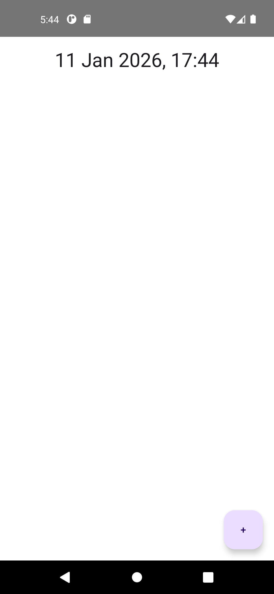
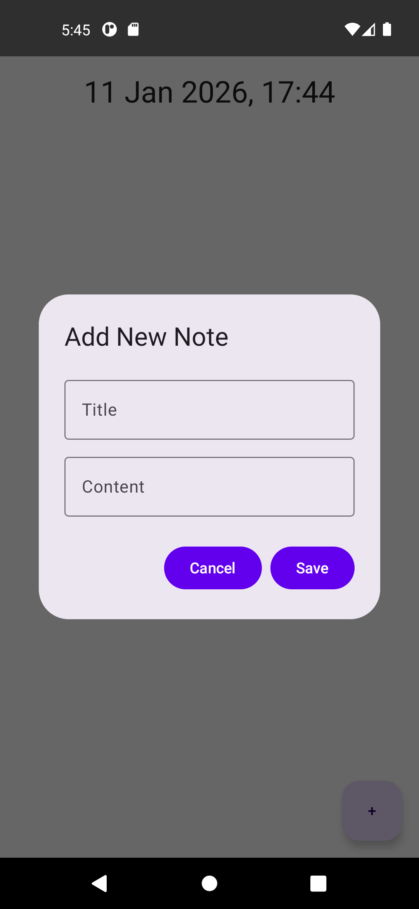
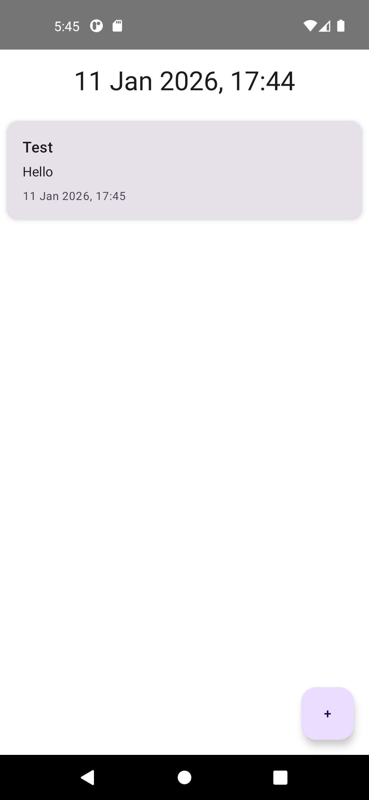

# NoteWorthy

NoteWorthy is a simple and elegant note-taking application for Android, built with 100% Kotlin and Jetpack Compose. It follows the principles of modern Android development, utilizing a clean architecture and the latest libraries to provide a seamless and intuitive user experience.

## Features

*   **Create and View Notes:** Easily create new notes with a title and content. View all your notes in a clean, scrollable list.
*   **Delete Notes:** Swipe to delete notes you no longer need.
*   **Undo Deletion:** Accidentally deleted a note? No problem! An "Undo" option is available to restore it.
*   **Local Storage:** Notes are stored locally on your device using Room, ensuring that your data is always available, even offline.
*   **Clean Architecture:** The app is built with a clear separation of concerns, making it easy to maintain and scale.
*   **Dependency Injection:** Uses Koin for managing dependencies, which simplifies the codebase and improves testability.

## Technologies Used

*   [Kotlin](https://kotlinlang.org/): The official programming language for Android development.
*   [Jetpack Compose](https://developer.android.com/jetpack/compose): A modern toolkit for building native Android UI.
*   [Material 3](https://m3.material.io/): The latest version of Google's design system.
*   [Room](https://developer.android.com/training/data-storage/room): A persistence library that provides an abstraction layer over SQLite.
*   [Kotlin Coroutines](https://kotlinlang.org/docs/coroutines-overview.html): For asynchronous programming.
*   [Kotlin Flow](https://kotlinlang.org/docs/flow.html): A reactive stream library for handling streams of data.
*   [Koin](https://insert-koin.io/): A pragmatic lightweight dependency injection framework for Kotlin.
*   [ViewModel](https://developer.android.com/topic/libraries/architecture/viewmodel): To store and manage UI-related data in a lifecycle-conscious way.

## Getting Started

To get a local copy up and running, follow these simple steps.

### Prerequisites

*   Android Studio Iguana | 2023.2.1 or later
*   Android SDK 34 or later

### Installation

1.  Clone the repo
    ```sh
    git clone https://github.com/Eomeara89/NoteWorthy.git
    ```
2.  Open the project in Android Studio.
3.  Build the project and run it on an emulator or a physical device.

## Screenshots




*( coming soon )*

## License

Distributed under the MIT License. See `LICENSE` for more information.
